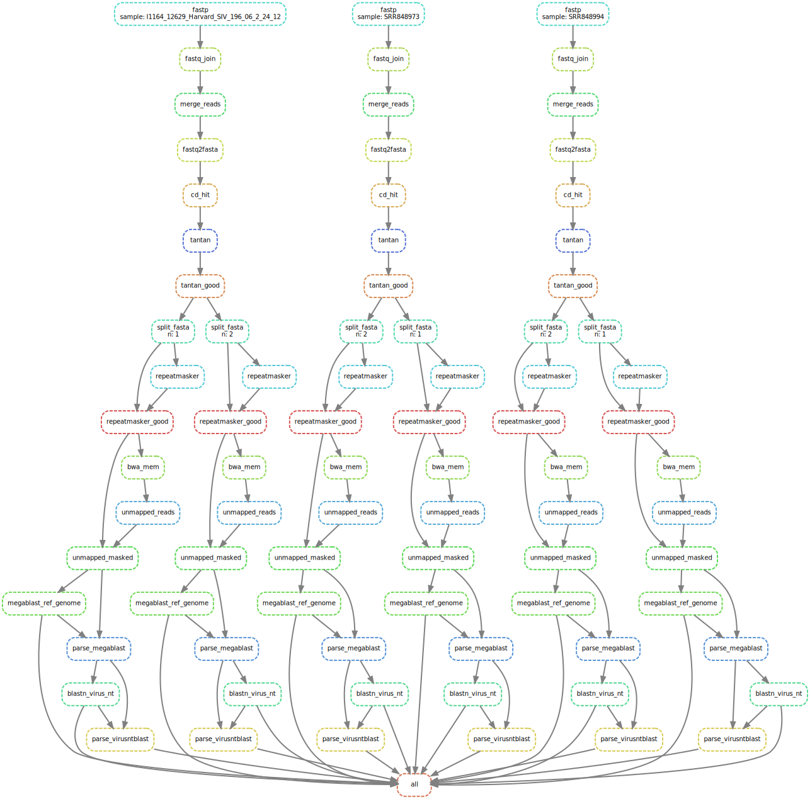
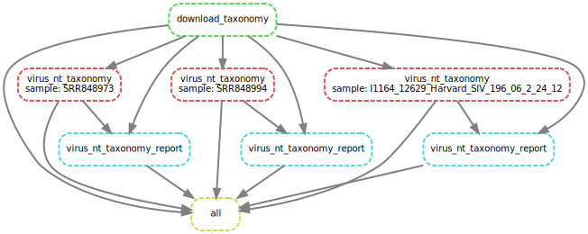

[](https://travis-ci.org/<USERNAME>/<REPO>)

The goal of this repo is to more reproducibly recreate [VirusSeeker Virome workflow](https://www.ncbi.nlm.nih.gov/pmc/articles/PMC5326578/). Original code is available on github.com/guoyanzhao.


## Setup environment and install prerequisites

### Download RepBase for RepeatMasker

Obtain access to RepBase from www.girinst.org. 
Download RepBase into separate directory e.g. "databases/repbase" under your home directory or whatever other location is good for you. 
For downloading set environment variables for GIRUSER and GIRPASS. 
```
mkdir databases/repbase
cd databases/repbase

GIRUSER=<your-gir-user-name>
GIRPASS=<your-gir-password>

wget --user $GIRUSER --password $GIRPASS --no-check-certificate http://www.girinst.org/server/RepBase/protected/repeatmaskerlibraries/RepBaseRepeatMaskerEdition-20170127.tar.gz

gunzip RepBaseRepeatMaskerEdition-20170127.tar.gz
tar xvf RepBaseRepeatMaskerEdition-20170127.tar
rm RepBaseRepeatMaskerEdition-20170127.tar
```

### Install miniconda

Download and install miniconda https://conda.io/docs/user-guide/install/index.html.
In case of Linux, following should work:
```
wget https://repo.continuum.io/miniconda/Miniconda3-latest-Linux-x86_64.sh
bash Miniconda3-latest-Linux-x86_64.sh
```

### Install environment

Create conda environment with preinstalled **snakemake**:
```
conda create -n snakemake -c bioconda -c conda-forge snakemake
```

### Activate environment

```
source activate snakemake
```

### Clone this repo and cd to repo
(Change URL accordingly if using HTTPS)

```
git clone git@github.com:avilab/vs.git
```

## 


## Example

### Dry run

```
snakemake -n
```

### Create workflow graph

```
snakemake --dag | dot -Tsvg > graph/dag.svg
```

### Real run

This workflow is meant to be run in cluster.
```
snakemake -j --use-conda --cluster-config cluster.json  \
             --cluster "sbatch -J {cluster.name} \
             -p {cluster.partition} \
             -t {cluster.time} \
             --mem {cluster.mem} \
             --output {cluster.output}"
```

All possible [snakemake execution](https://snakemake.readthedocs.io/en/stable/executable.html) options can be printed by calling `snakemake -h`.

```
--max-jobs-per-second 1 --max-status-checks-per-second 10 --rerun-incomplete
```

### Exit/deactivate environment

```
source deactivate
```

## Workflow graph
For technical reasons, workflow is split into two parts, virome and taxonomy, that can be run separately, but taxonomy depends on the output of virome. Virome subworkflow (virome.snakefile) munges, masks, and blasts input sequences. Taxonomy subworkflow (Snakefile) merges blast results with taxonomy data and generates report.



Figure 1. **Virome workflow** graph with three example samples split into two (default = 20) for parallel processing. Outputs BLAST results.



Figure 2. **Taxonomy workflow** graph with three example samples. Outputs report in html format and taxonomy table of virus hits.
